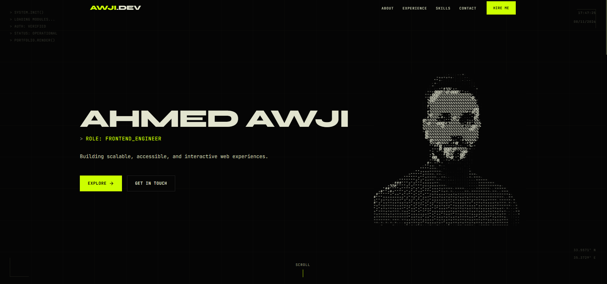
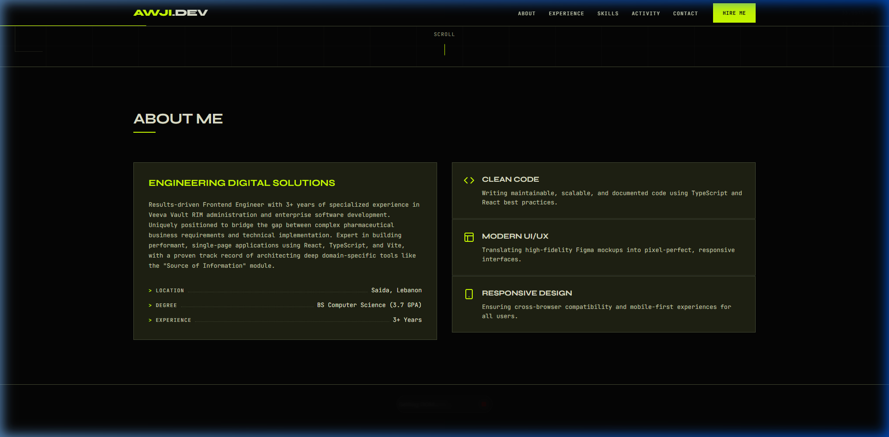
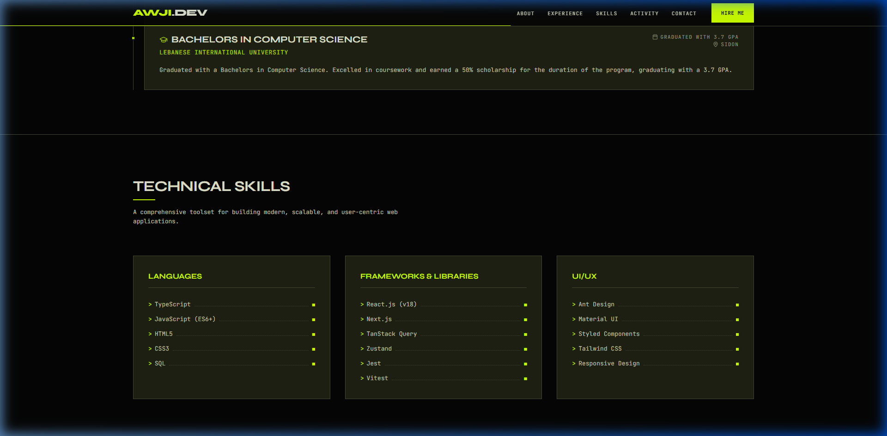
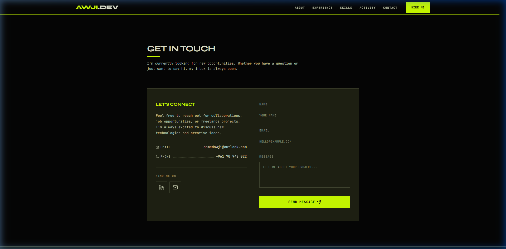
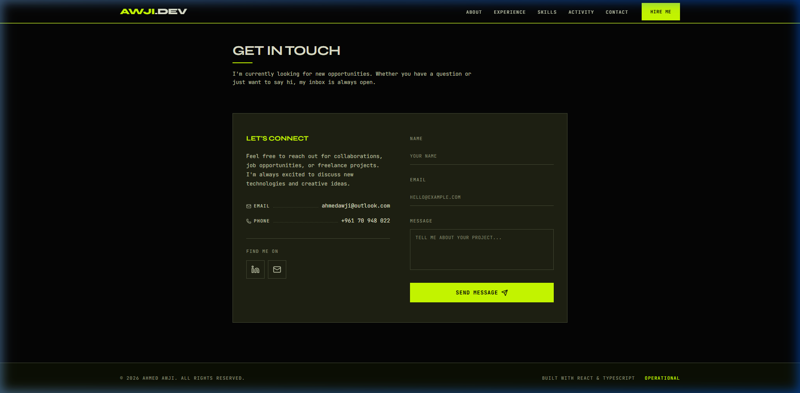

# Ahmed Awji — Developer Portfolio

> **NEO-OPERATOR** · Brutalist Terminal Design System · High-Performance Frontend Portfolio

A high-contrast, brutalist developer portfolio built with React, TypeScript, and Framer Motion. Powered by the **NEO-OPERATOR** design system—featuring zero-radius geometry, 1px structural borders, terminal-inspired telemetry, and vivid lime accents.

---

## 📸 Section Previews

### 01 / Terminal Boot & Hero
Dynamic terminal boot sequence with animated system initialization, floating viewport coordinates, display typography, and quick-action terminal prompts.



---

### 02 / Telemetry & About
Leader-line metric readouts, structural 1px bordered capability cards, and technical profile overview.



---

### 03 / Technical Capabilities & Skills
Categorized technology matrix featuring leader lines and status indicators.



---

### 04 / Transmission & Contact
Terminal-styled inputs with active focus states, leader-line contact points, and direct action triggers.



---

### 05 / Status & Footer
Minimalist 1px structural footer with live operational status indicator.



---

## 🎨 Design System: NEO-OPERATOR

| Token | Value | Description |
|:---|:---|:---|
| **Background Base** | `#050505` | Deep black canvas |
| **Surface Dark** | `#0A0D05` / `#111508` | High-contrast container surface |
| **Accent Lime** | `#CCFF00` | Primary action & highlight accent |
| **Text Primary** | `#F5F5F0` | High-legibility off-white |
| **Text Muted** | `#8E947A` / `#5A6048` | Terminal metadata & timestamps |
| **Border** | `1px solid rgba(204, 255, 0, 0.15)` | Structural 0px-radius gridlines |
| **Typography** | **Syne** (Headings) + **JetBrains Mono** (Body/Code) | Architectural brutality meets monospace precision |

---

## 🛠️ Tech Stack

- **Framework**: [React 19](https://react.dev/)
- **Build Tool**: [Vite](https://vitejs.dev/)
- **Language**: [TypeScript](https://www.typescriptlang.org/)
- **Animation**: [Framer Motion](https://www.framer.com/motion/)
- **Icons**: [Lucide React](https://lucide.dev/)
- **Styling**: Custom CSS Design Tokens (`index.css`)

---

## 🚀 Getting Started

### Prerequisites
- **Node.js** (v18 or higher recommended)
- **npm** or **yarn**

### Installation

```bash
# Clone the repository
git clone https://github.com/ahmadawji/My-Porftolio.git

# Navigate to project directory
cd My-Porftolio

# Install dependencies
npm install
# or
yarn install
```

### Development

```bash
# Start local dev server
npm run dev
# or
yarn dev
```

The application will be accessible at `http://localhost:3000/My-Porftolio/` (or your assigned Vite port).

### Production Build

```bash
# Build production bundle
npm run build
# or
yarn build

# Preview production build locally
npm run preview
# or
yarn preview
```

---

## 📁 Project Structure

```text
├── components/
│   ├── About.tsx           # Telemetry & profile summary
│   ├── Contact.tsx         # Terminal message transmission
│   ├── Experience.tsx      # Chronological career logs
│   ├── Footer.tsx          # Status line & copyright
│   ├── Hero.tsx            # Terminal boot sequence & hero
│   ├── Home.tsx            # Main section orchestrator
│   ├── Navbar.tsx          # Brutalist nav & scroll progress
│   └── Skills.tsx          # Technical matrix & capabilities
├── constants.tsx           # Portfolio content & profile data
├── index.css               # NEO-OPERATOR design system tokens & styles
├── types.ts                # TypeScript interface definitions
├── DESIGN.md               # Design system specifications & rules
└── README.md               # Repository documentation & preview
```
